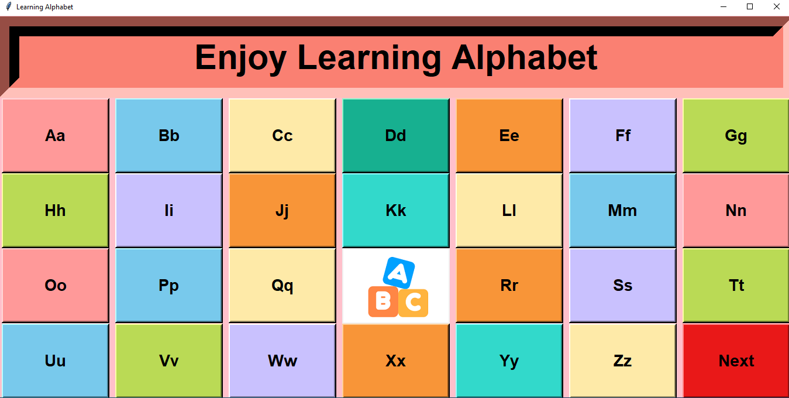

# Learning Alphabet
A python game where user can learn alphabet. It shows picture that corresponds to the letter chosen. Theres also a section where the user need to provide the letter and pronounce it correctly.

# Installation
pip install pygame
pip install pillow
pip install pymysql
pip install gtts
pip install playsound
pip install pyttsx3
pip install SpeechRecognition

      

